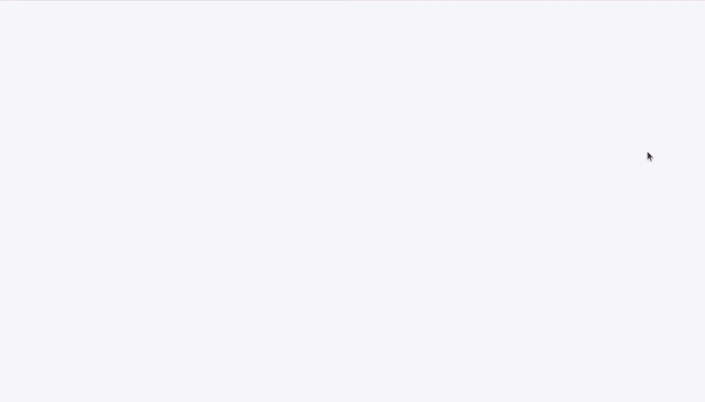
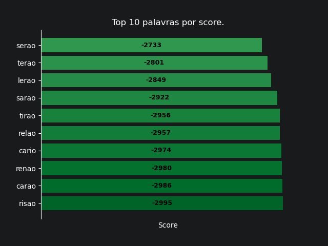
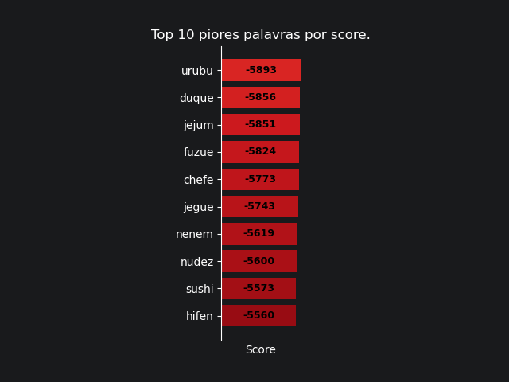
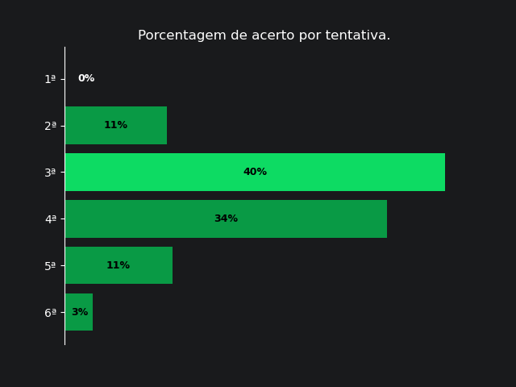
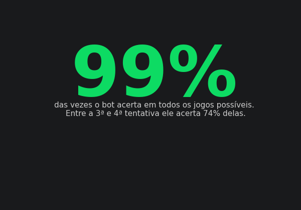

  

# Termo-Solver
Para pôr em prática meus conhecimentos em Python e Machine Learning, decidi criar um agente capaz de resolver o jogo de navegador chamado Termo. A ideia principal, no começo do projeto, era criar um agente de Machine Learning que pudesse solucionar todas as variantes do jogo (Dueto e Quarteto), mas, como o agente heurístico sem Machine Learning alcançou uma acurácia de 99%, decidi parar por aqui, sem a necessidade de implementar a complexidade do Machine Learning neste projeto.

### Sobre o jogo:
Term.ooo ou Termo é um jogo de palavras online [...]. No jogo, os jogadores têm seis tentativas para identificar uma palavra secreta de cinco letras em português, com feedback codificado por cores após cada tentativa, indicando se as letras estão corretamente posicionadas, presentes, mas fora de posição, ou ausentes da palavra. Uma nova palavra é divulgada diariamente e é idêntica para todos os jogadores do mundo. Além do formato padrão, são oferecidas duas variantes: Dueto, que desafia os jogadores a resolver duas palavras simultaneamente, e Quarteto, que exige a resolução de quatro palavras ao mesmo tempo. [*Wikipédia*](https://pt.wikipedia.org/wiki/Term.ooo)

### Sobre o ambiente e dataset
Foi codificado um modelo do ambiente real do jogo usando o dataset de palavras válidas e palavras corretas, encontrado no Kaggle. A função `try_word_check` recebe como parâmetro a tentativa de palavra e a palavra-alvo, que seria a palavra correta para vencer o jogo. O sistema de validação verifica quais letras estão na posição correta e as marca com o número `1` em uma lista de tamanho igual ao da palavra. Como no jogo todas as palavras possuem 5 letras, o sistema de validação cria uma lista de 5 valores, onde `1` indica a letra correta na posição correta, `0` indica letras que existem na palavra mas estão na posição errada, e `-1` indica letras que não existem na palavra-alvo. O retorno da função é essa lista de 5 posições, com cada valor sendo `1`, `0` ou `-1`. O ambiente então escolhe uma palavra aleatória do dataset com `random.choice(valid_answers)`, e com isso é possível testar várias palavras usando a função `try_word_check` até receber o array `[1, 1, 1, 1, 1]`, que indica que a palavra aleatória foi acertada. A função `run_game()` do arquivo `Termoo.ipynb` simula um ambiente para um humano jogar o jogo.
Dataset: [Term.ooo Valid Guesses and Answers](https://www.kaggle.com/datasets/lucashohmann/termooo-valid-guesses-and-answers).

### Sobre os agentes
Para testar o ambiente de maneira automática e validar resultados simples, foi criado um bot que chuta palavras de maneira aleatória usando apenas `random.choice(valid_answers)`. Esse bot perde 99% dos jogos e foi criado apenas para auxiliar o desenvolvimento do ambiente. A função `test_agent` de `termo_agents.ipynb` recebe um agente como parâmetro e o número de épocas, que equivale à quantidade de jogos. A cada jogo, é escolhida aleatoriamente uma palavra e o bot tem 6 tentativas para acertá-la. Caso acerte, é anotado em uma lista de 7 posições em qual tentativa o bot acertou a palavra correta — a última posição dessa lista representa os casos em que o bot não consegue acertar em 6 tentativas. A função retorna um array de números indicando a distribuição de vitórias por tentativa ao longo dos jogos ou épocas.

Com o ambiente devidamente criado, foi desenvolvido primeiramente um bot que calcula o score de todas as palavras e encontra a palavra com maior score, calculando cada palavra do dataset contra ela mesma. O score é obtido pela soma dos retornos da função `try_word_check` em `ranking_words`, quanto mais `1`s houver no array de 5 posições, maior será o score da palavra. As piores palavras possuem score muito baixo, pois quase nunca acertam nenhuma posição correta ou letra existente na palavra-alvo. Com a função `ranking_words` é possível encontrar as 10 melhores palavras para iniciar qualquer partida de Termo, bem como a melhor palavra para abrir o jogo, por meio da ordenação decrescente do score. Ordenando a lista de forma crescente, conseguimos ver as 10 piores palavras para iniciar a partida e também a pior palavra.

O agente _simple reflex_ foi criado para resolver o jogo do Termo na modalidade com uma única palavra, e, posteriormente, o _model based agent_ foi criado para solucionar as variações do jogo (Dueto e Quarteto), calculando o score e tentando a palavra com maior score com base nos demais jogos ocorrendo simultaneamente. Esse agente vence 99% das vezes.

### Métricas e validações
Para calcular manualmente a precisão do bot com exatidão, utilizei uma simulação exaustiva com todas as 1442 possíveis palavras.

---
> IA foi utilizada neste projeto apenas para auxílio na redação deste README, debug do código e estudo da biblioteca Playwright.
